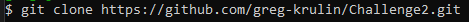
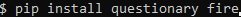
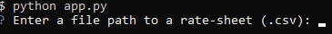
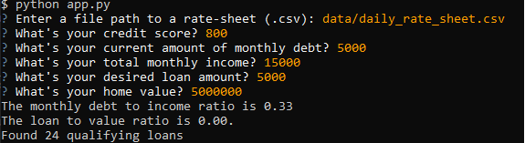
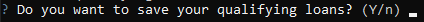
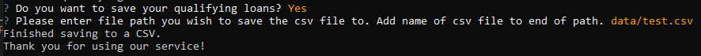

# Project Title

This application is a challenge from Bootcamp to create a loan qualifier application. The application goes through a list of banks' qualifying loans (which user provides) and then asks the user finacial questions. Based on information user provides, the program will determine which loans the user qualifies for. It then asks if the user wishes to save the list, and where to save it too.

It is recommended the user saves the list as a CSV file.

---

## Technologies

This project was created with: 

*Python 3.10.10
*questionary 1.10.0
*fire 0.5.0

---

## Installation Guide

---

To install the loan qualifier application, follow these steps:

Clone the repository to your local machine:

Navigate into the project directory

Install the required dependencies:

## Usage

---

1) Run the loan qualifier application in the terminal:

2) Input the financial data as prompted by the application:

3) If there are any loans, application will ask if you wish to save the list:

4) If you want to save the qualifying loans to a CSV file, the application will prompt you to provide a file path:

**Note**

If there are not any loans available application will let user know and end.

There are also some issues with code right now:

User can place negative credit scores and absurdly high ones
User can save data as a non-csv file type, so some techincal know how is required from user.

## Contributors

In this section, list all the people who contribute to this project. You might want recruiters or potential collaborators to reach you, so include your contact email and, optionally, your LinkedIn or Twitter profile.

Thank you to the Fintech Berkely Bootcamp for providing the assigment. Most of the code is from the bootcamp with tweaks
and a few functions from me.

My email to reach me is grgr279@gmail.com.

---

## License

This project is licensed under the terms of the MIT license.